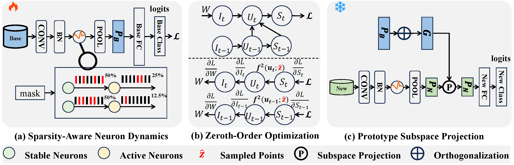

# SAFA-SNN

## This is the official code repository for the project: SAFA-SNN: Sparsity-Aware On-Device Few-Shot Class-Incremental Learning with Fast-Adaptive Structure of Spiking Neural Network (ICLR 2026) [[paper](https://openreview.net/pdf?id=9jcB40wjk3)]

## Overview

<p align="center">
  
</p>

<p align="center">
  <em>The overall framework of our proposed method SAFA-SNN.</em>
</p>

SAFA-SNN framework includes three main components: (a) Training abundant data in the base session and selecting active 
and stable neurons by masks. In incremental learning sessions, activate neurons will substantially adjust their firing 
thresholds based on sparsity to incorporate new classes, while stable neurons maintain their prior firing behavior 
through only slight threshold variations. (b) Top: forward propagation through FSCIL process; Bottom: backpropagation 
using zeroth-order optimization only in the base class training. (c) Freezing backbones and updating the prototypes by 
orthogonal subspace projection in the incremental learning.


## Environment Required

python==3.10.9    
torch==2.5.1    
tqdm==4.64.1  
numpy==1.23.5  
cuda==12.2  
torchvision==0.20.1  
spikingjelly==0.0.0.0.14

## Run
```
python main.py --config jsons/safa.json
```

## Contact
If you have any questions about our work or this repository, please contact us by email [huijingzhang@zju.edu.cn](mailto:huijingzhang@zju.edu.cn).

## Acknowledge

We would like to thank the developers of the following open-source projects for their invaluable contributions:

[CEC](https://github.com/icoz69/CEC-CVPR2021)

## Citation

If you find this repository useful in your research, please cite our paper:

```bibtex
@inproceedings{
  zhang2025safa,
  title={SAFA-SNN: Sparsity-Aware On-Device Few-Shot Class-Incremental Learning with Fast-Adaptive Structure of Spiking Neural Network},
  author={Zhang, Huijing and Cao, Muyang and Jiang, Linshan and Du, Xin and Yu, Di and Lv, Changze and Deng, Shuiguang},
  booktitle={The Fourteenth International Conference on Learning Representations},
  year={2026},
  url={https://openreview.net/pdf?id=9jcB40wjk3}
}
